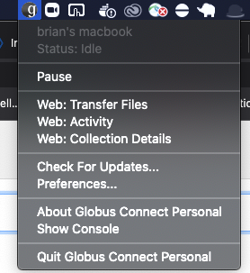
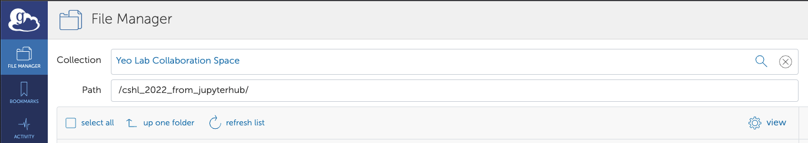
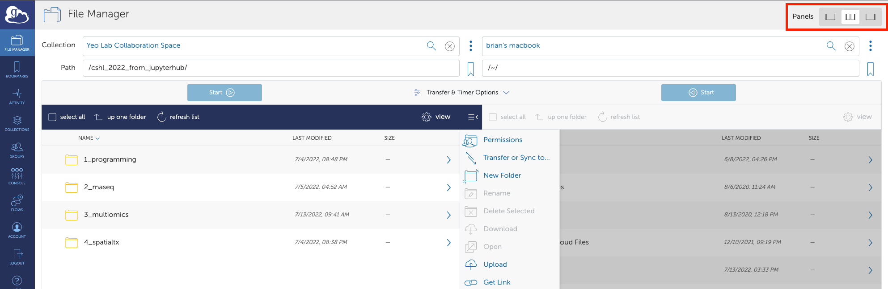
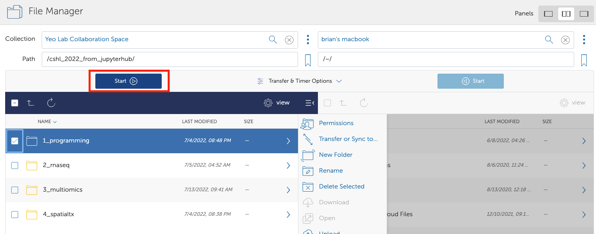

# CSHL Single Cell Analysis 2022- Bioinformatics
Collection of material to use for CSHL's Single Cell Analysis course 2022

# Code Access:
This repository contains all notebooks and slide material for the bioinformatics modules for this course. Feel free to download or refer to this repo (you do not need to be logged in to access this public repository).

# Data Access:
Students enrolled in this course may download raw data (not public) through [Globus](https://www.globus.org/), which is a file transfer broker that works by connecting two endpoints together. Thus, in order to transfer data from one established endpoint (e.g. TSCC, Jupyterhub) to another, you will need to establish a destination endpoint (e.g. your personal laptop). 

### Please note that in order to access this data, you will need to be logged in using the same credentials (e.g. university credentials) as what you have used to log into Jupyterhub!

## Instructions for downloading data:
1. Download and install [Globus Connect Personal](https://www.globus.org/globus-connect-personal) software onto your machine.
2. Follow the instructions to activate your endpoint. You should see a tiny "G" on the top menu bar (Mac) or bottom (Windows) if your endpoint is activated.

3. Log onto [Globus](https://www.globus.org/) and navigate to the file browser.
4. Search for the endpoint that contains all of the course data. After the course, data will be kept in the "Yeo Lab Collaboration Space" under the folder "/cshl_2022_from_jupyterhub/":
 (Or, click this [link](https://app.globus.org/file-manager?origin_id=6bfaee95-e061-4ad8-a4ef-0e65ef4aabc8&origin_path=%2Fcshl_2022_from_jupyterhub%2F) if you are already logged in).
5. Search for your own endpoint (you will have named your endpoint during setup). If you only see one panel, you may need to select the "double pane" view:

6. Use the Globus file manager to initiate a transfer:
